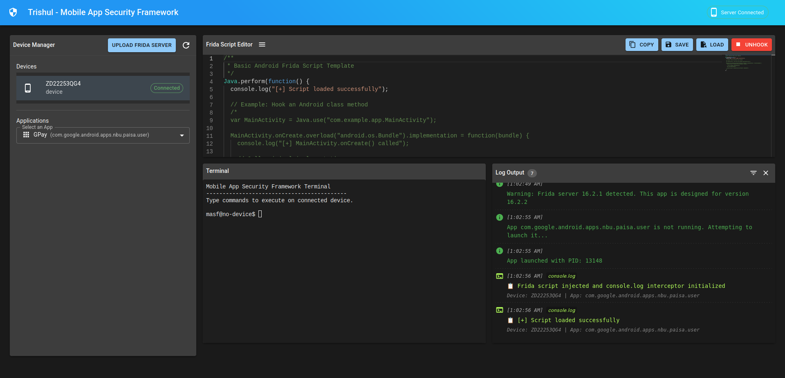

# Trishul - Mobile App Security Framework

<p align="center">
  
</p>

A web-based framework for mobile application security testing. Trishul simplifies the process of setting up and using tools like Frida for application hooking and security analysis.



## Features

- Web-based interface for mobile application security testing
- Automatic setup and management of Frida server on rooted devices
- Remote command execution and device management
- Hooking capabilities directly from the browser
- Real-time monitoring and analysis
- Built-in terminal for direct device interaction
- Sample scripts for common security testing scenarios

## Requirements

- Python 3.8+
- Node.js 14+
- Rooted Android/iOS device with USB debugging enabled
- ADB tools installed on the server

## Installation

### Option 1: Docker (Recommended)

The easiest way to set up Trishul is using Docker:

1. Install [Docker](https://docs.docker.com/get-docker/) and [Docker Compose](https://docs.docker.com/compose/install/)

2. Clone the repository:
   ```
   git clone https://github.com/xronyx/trishul.git
   cd trishul
   ```

3. Start the container:

   **For Linux/macOS:**
   ```bash
   chmod +x start-docker.sh
   ./start-docker.sh
   ```

   **For Windows:**
   ```cmd
   start-docker.bat
   ```

4. Access the web interface at `http://localhost:5000`

5. Connect your rooted Android device via USB and ensure USB debugging is enabled

### Option 2: Manual Installation

1. Clone the repository:
   ```
   git clone https://github.com/xronyx/trishul.git
   cd trishul
   ```

2. Run the deployment script:

   **For Linux/macOS:**
   ```bash
   chmod +x deploy.sh
   ./deploy.sh
   ```

   **For Windows:**
   ```cmd
   deploy.bat
   ```

3. The script will:
   - Check for prerequisites
   - Set up a Python virtual environment
   - Install Python dependencies
   - Build the React frontend
   - Create necessary directories

## Usage

If using Docker, the application is already running after starting the container.

If using manual installation:

1. Start the server:

   **For Linux/macOS:**
   ```bash
   source venv/bin/activate
   python server.py
   ```

   **For Windows:**
   ```cmd
   venv\Scripts\activate.bat
   python server.py
   ```

2. Open your web browser and navigate to:
   ```
   http://localhost:5000
   ```

3. Connect your rooted Android device via USB and ensure USB debugging is enabled

4. Use the Device Manager panel to:
   - Connect to your device
   - Upload Frida server if not already installed
   - Browse and select target applications

5. Write Frida scripts in the Script Editor panel or use sample scripts from the samples directory

6. Click "Hook" to inject your script into the selected application

7. View script output and system logs in the Log Output panel

8. Use the Terminal panel to execute shell commands directly on the device (under maintainance)

## Docker USB Passthrough

The Docker setup is configured to provide direct access to USB devices for ADB communication:

- Uses privileged mode to access USB devices
- Maps `/dev/bus/usb` from the host to the container
- Uses host network mode to simplify ADB communication
- Preserves logs and uploads in mounted volumes

## Sample Scripts

The framework includes sample scripts in the `samples` directory:

- `android_ssl_pinning_bypass.js`: Bypasses SSL certificate pinning in Android apps
- `android_api_tracer.js`: Traces common Android API calls for security analysis

## Troubleshooting

- Ensure your device is properly connected and USB debugging is enabled
- Verify that your device is rooted and that Frida server is properly installed
- Check the Log Output panel for error messages
- Restart the application or device if you encounter connection issues

### Docker-specific Troubleshooting

- If devices aren't detected in the container:
  - Check that USB debugging is enabled on your device
  - Ensure the device is connected before starting the container
  - Try restarting the ADB server on your host system: `adb kill-server && adb start-server`
  - Restart the Docker container: `docker-compose restart`

## License

This project is licensed under the MIT License - see the LICENSE file for details.

## Acknowledgments

- [Frida](https://frida.re/) - Dynamic instrumentation toolkit
- [Flask](https://flask.palletsprojects.com/) - Python web framework
- [React](https://reactjs.org/) - Frontend library
- [Material-UI](https://mui.com/) - React component library
- [Xterm.js](https://xtermjs.org/) - Terminal emulator
- [Monaco Editor](https://microsoft.github.io/monaco-editor/) - Code editor 